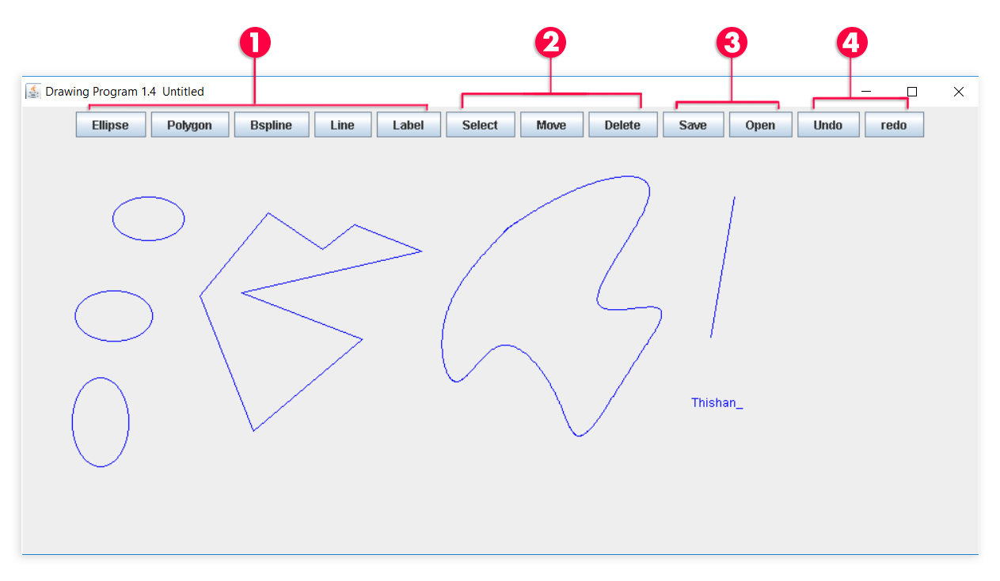

# Drawing-Program
A simple drawing program that draws 2D shapes such as lines, ellipse, polygon, text and B-Splines. After drawing the shape in the canvas user can 
select each shape indiviually and move them as desired. User can undo and redo each command that's been executed. Further the edited file can be saved and retrived.
## How to run the program: (Requires XMing [link to setup XMing](http://laptops.eng.uci.edu/software-installation/using-linux/how-to-configure-xming-putty))
  ```
  javac src/DrawingProgram.java
  java src/DrawingProgram
  ```
  
## How to use


### Commands
1)	Drawing the shapes
2)	Editing the Shapes
3)	Saving and Opening a file
4)	Undo and Redo operations


## System Architecture
This application is built in a Model-View-Controller (MVC) architecture.

- ### Model:
  * The Model is responsible for handling all the data, such as storing the number of items drawn and the number of items currently selected in memory.
  * The Model is also responsible for adding and removing the number of items in the canvas and the number of items currently selected.
  * Saving the drawn items into a file and then retrieve the file is handled by the Model.

- ### View:
  * The View is responsible for taking the items from the Model and drawing them on the screen.
  * The View is also responsible for listening for user inputs and executing them on the controller once the user interacts with the application.

- ### Controller:
  * The ```UndoManager``` in this program handled the role of the controller. ```UndoManager``` takes each command from the View and executes them in the Model.
  * The UndoManager maintains two stacks, one for Undo (```history```) and one Redo (```redoStack```) operations. The UndoManager takes each command and stores in the ```history``` stack as it executes each command against the Model. Once when the undo function gets called, it pops the last command from the history stack and executes a reverse operation of that particular command, and then that command gets pushed into the ```redoStack```. Also, it does the same sequence in reverse order when the redo function gets called using the ```redoStack```.
  
## Abstract Base classes
- ### Item: 
  * Item is a Serializable abstract class. This class provides the interface to define and update the data of the draw object as points.
- ### Command
  * This class provides an interface to create commands that support Undo and Redo operations and execute against the Model.
- ### UIContext
	* This class provides an interface to the View to draw different types of Items.
